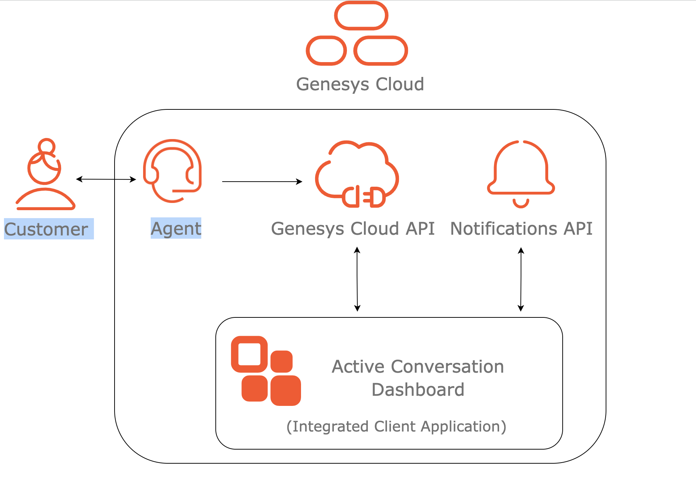

# Develop an integration app that uses Partial Transcript notifications

This Genesys Cloud Developer Blueprint demonstrates an example of how partial transcript notifications can be used in the context of a Genesys Cloud Integration. The sample app is about an admin dashboard that allows administrators to view active conversations in the admin's organization queues. The administrator can look at info about each conversation, including the ongoing transcript, and assign the call and "standing" of the call. The "standing" of the call is a binary good-or-bad state depending whether the agent uttered one of the red-listed words. The blueprint describes the required steps to develop and integrate this app into the Genesys Cloud app.

