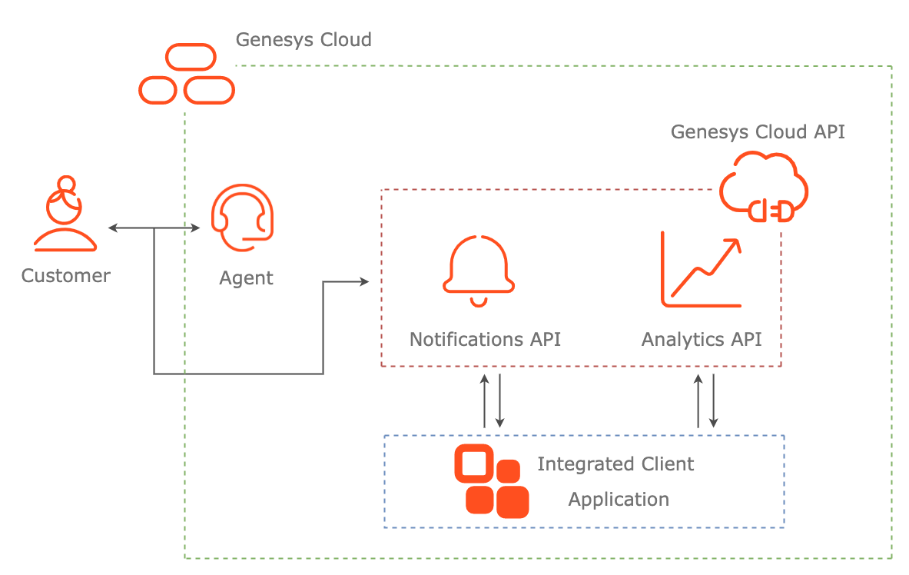

# Develop an Integration App That Utilizes Partial Transcript Notifications. (DRAFT)

## Description

This Genesys Cloud Developer Blueprint demonstrates an example of how partial transcript notifications can be used in the context of a Genesys Cloud Integration.  The sample app is based around an admin dashboard that allows administrators to view the active conversations for the queues in the admin's organization.  The admin is able to view info about each conversation, including its ongoing transcript, the agent assigned to the call, and the "standing" of the call, which is a binary good-or-bad state depending on whether one of the red-listed words is uttered by the agent.  The blueprint will describe the steps needed to develop this app and integrate it into the Genesys Cloud app.

See the blueprint documentation for more details
