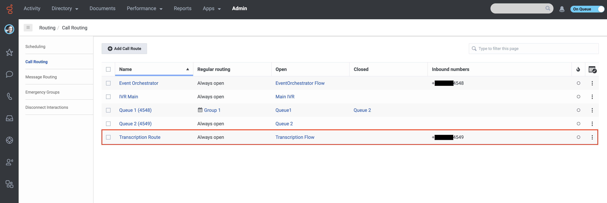
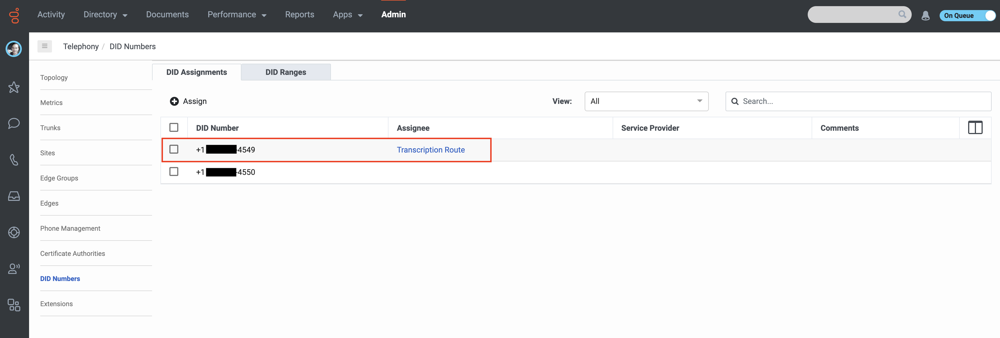

## Contents

* [Solution Components](#solution-components "Goes to the Solutions Components section")
* [Requirements](#requirements "Goes to the Requirements section")
* [Running Locally](#running-locally "Goes to the Running Locally section")
* [Sample App Overview](#sample-app-overview "Overview of the sample app's features")
* [Configuring the React Project to use Genesys Cloud SDK](#configuring-the-react-project-to-use-genesys-cloud-sdk "How to integrate the Genesys Cloud SDK")
* [Additional resources](#additional-resources "Goes to the Additional resources section")


## Solution components

- **Genesys Cloud** - A suite of Genesys cloud services for enterprise-grade communications, collaboration, and contact center management. You deploy the Chat Translator solution in Genesys Cloud.
- **Genesys AppFoundry** - The Genesys app marketplace for solutions that run on the Genesys Cloud platform. You download the integration used in this solution from the Genesys AppFoundry.
- **Client Application integration** - The Genesys Cloud integration that embeds third-party webapps via iframe in the Genesys Cloud UI. For more information, see: [Set up a Client Application integration](https://help.mypurecloud.com/?p=131851 "Goes to Set up a Client Application integration page") in the Genesys Cloud Resource Center.

## Prerequisites

### Specialized knowledge

* Experience with Typescript or JavaScript
* Administrator-level knowledge of Genesys Cloud


### Software development kit (SDK)

- **Platform API JavaScript Client** - The sample app employs React+TypeScript, thus the javaScript SDK is used here. However, the same functionality could be achieved using other languages. Find the Platform API JavaScript Client here: https://github.com/MyPureCloud/platform-client-sdk-javascript
- **Genesys Cloud Client App SDK** - A JavaScript library used to integrate third-party web-based applications with Genesys Cloud. Handles app and UI-level integrations such as navigation, alerting, attention, and lifecycle management.

## Requirements

### Specialized knowledge

Implementing this solution requires experience in several areas or a willingness to learn:

- Administrator-level knowledge of Genesys Cloud
- Genesys Cloud Platform API knowledge
- React knowledge
- TypeScript knowledge


### Genesys Cloud account requirements

This solution requires a Genesys Cloud license. For more information on licensing, see [Genesys Cloud Pricing](https://www.genesys.com/pricing "Opens the pricing article").

A recommended Genesys Cloud role for the solutions engineer is Master Admin. For more information on Genesys Cloud roles and permissions, see the [Roles and permissions overview](https://help.mypurecloud.com/?p=24360 "Opens the Roles and permissions overview article").

## Running locally

### Download the repository that contain the project files
Go to the [Partial Transcription Blueprint](https://github.com/GenesysCloudBlueprints/partial-transcription-blueprint) repository and clone it to your machine.

```bash
git clone https://github.com/GenesysCloudBlueprints/partial-transcription-blueprint.git
```

### Create an Implicit Grant OAuth

1. Log in to your Genesys Cloud organization and create a new OAuth Credential (Implicit Grant). [Create an OAuth Client](https://help.mypurecloud.com/articles/create-an-oauth-client/)
2. Add **http://localhost:3000** to the **Authorized redirect URIs**. Note: If you've changed the **redirecUri** value in the config file, then you must add that new URI instead.
3. Add the following in the Scopes section:
    * analytics
    * authorization
    * conversations
    * notifications
    * routing
    * users
4. Save the Client ID for use in the configuration of the project.

### Update configuration file

Modify the values in the configuration file before running the app. Use the values from the OAuth Client you created in the last step as follows:

clientConfig.js:

```javascript
export const clientConfig = {
  GENESYS_CLOUD_CLIENT_ID: '<YOUR CLIENT ID HERE>',
  REDIRECT_URI: '<YOUR PRODUCTION URI HERE>',
};
```

### Run the app

Open a terminal and set the working directory to the root directory of the project, then run the following:

```bash
npm install
npm run start
```

### Install and activate the client application in Genesys Cloud
1. Log in to your Genesys Cloud organization and add an integration. For more information, see [Add an integration](https://help.mypurecloud.com/articles/add-an-integration/) in the Genesys Cloud Resource Center.
2. Install the **Client Application** integration. For more information, see [Set up a Client Application integration](https://help.mypurecloud.com/articles/set-custom-client-application-integration/) in the Genesys Cloud Resource Center.
3. (Optional) Use the Name box to give the widget a meaningful name. For example, **Active Conversation Dashboard**.

4. Click the Configuration tab.
5. In the Application URL box, type the URL of the web application. Be sure to specify the full URL.
`https://localhost:3000`
6. In the Application Type dropdown, select **widget**
7. To limit access to specific groups of agents, in Group Filtering, select the groups that can use the widget.

8. Activate the client application

### Test the solution
1. Select a queue that you are a member of and activated in. Setting up a test queue with only yourself as a member is a quick solution here, since this guarantees you are assigned inbound calls to the queue.  See [Create and configure queues](https://help.mypurecloud.com/articles/create-queues/) in the Genesys Cloud Resource Center for more.
** - Make sure that “Voice Transcription” is enabled in both the queue settings and in Speech and Text Analytics:


2. Make sure that there is an inbound call flow configured to transfer inbound calls to the queue you selected.  See [Work with inbound flows](https://help.mypurecloud.com/articles/work-with-inbound-call-flows/) in the resource center for more.


3. Make sure that there is a call route assigned to the inbound call flow from the previous step. See [Add a call route](https://help.mypurecloud.com/articles/add-a-call-route/) in the resource center for more.


4. Make sure that there is a DID number assigned to the call route from the previous step. See [Manage DID and toll-free number assignments](https://help.mypurecloud.com/articles/manage-did-and-toll-free-number-number-assignments/) in the resource center for more.

5. Click the slider in the upper right-hand corner of the Genesys Cloud UI to go **On Queue**
6. Using a phone, call (or have someone else call) the DID number mentioned above.
7. Using the dialpad or voice, answer the prompts from the IVR flow to navigate to your selected Queue.
8. Answer the incoming call in the Genesys Cloud app.
9. Open the Apps in the side navigation bar.
10. Open the client application, which was set up in previous steps.
11. Find your queue in the **Active Conversation Dashboard** and expand to find your active conversation's listing.

## Sample app overview

### Genesys Cloud Utils

The `src/utils/genesysCloudUtils.ts` file contains the intermediate functions that in turn call Genesys Cloud SDK methods. These functions return promises that are handled upon resolution in the file and in the invoking components themselves.

### Active conversation dashboard

This is the top level of the SPA (Single Page Application). This level consists of tile, description, and a list of the queues in the organization of the logged-in user.

### Queue listing

Each queue listing consists of an "accordion."  Before expansion, it displays the queue's title and the number of active conversations in the queue.  After being expanded, it displays the conversation listings for the queue. 

### Conversation listing

Like the queue listings, each conversation listing is an "accordion." In this case, expanding the listing shows the conversation start time, the "standing" of the conversation (as defined in the summary of this document), the agent assigned to the conversation, and a live transcript of the conversation.

## Configure the React Project to use Genesys Cloud SDK

Now we view the steps needed to integrate the Genesys Cloud SDK into your own React app.

### Creating a React Project

If you are creating an app from scratch, run the following commands in a terminal in the directory of your choice:

```bash
npm install -g npx
npx create-react-app name-of-your-app --template TypeScript
```

If you're configuring an existing React app, it is suggested that you use a version greater than v16.0, since the sample app uses React hooks introduced in React v16.0.
See the tsconfig.json file in the root directory of this project for a TypeScript configuration example.

### Install NPM packages

1. Install the Genesys Cloud Platform Client:

    ```bash
    npm install purecloud-platform-client-v2
    ```

### Import the platform-client-sdk to your project

Use the following to import the platform-client-sdk:

```javascript
const platformClient = require('purecloud-platform-client-v2/dist/node/purecloud-platform-client-v2.js');
```
You can now use the various API tools contained in the platformClient object.

Example:

```javascript
const platformClient = require('purecloud-platform-client-v2/dist/node/purecloud-platform-client-v2.js');
const searchApi = new platformClient.SearchApi();
const usersApi = new platformClient.UsersApi();
const analyticsApi = new platformClient.AnalyticsApi();
const tokensApi = new platformClient.TokensApi();
const routingApi = new platformClient.RoutingApi();
const presenceApi = new platformClient.PresenceApi();
const conversationsApi = new platformClient.ConversationsApi();
```

## Additional resources

* [Genesys Cloud Platform SDK - JavaScript](/api/rest/client-libraries/javascript/)
* [GitHub Repository](https://github.com/GenesysCloudBlueprints/partial-transcription-blueprint.git)
* [Create a New React App](https://reactjs.org/docs/create-a-new-react-app.html)

